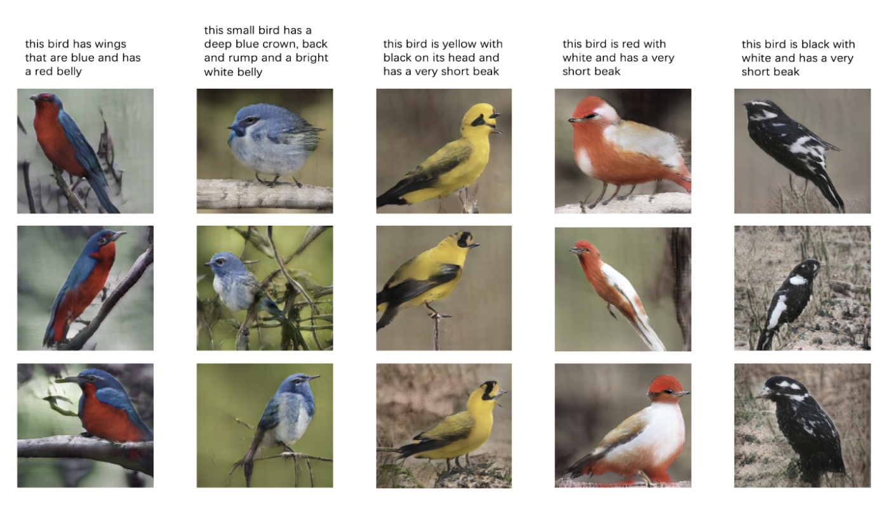
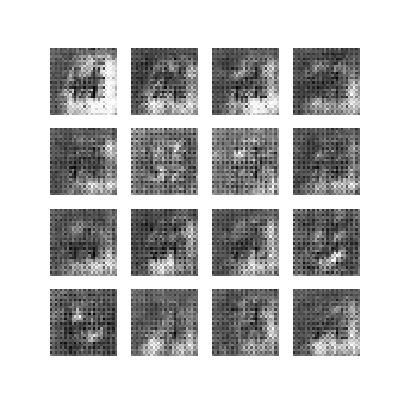
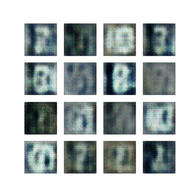

## Welcome to Chirong's Page

I am Chirong, a data science passionate new graduate from Columbia Statistics Program.

### Projects I have done in Columbia

1. Text-to-Image Bird Generation

In this project, we propose a Style-Based Attentional Generative Adversarial Network (SBAGAN) that allows unsupervised disentanglement
of high-level attributes and an attention-driven refinement for text-to-image generation. Borrowing
from StyleGan literature and AttnGan structure,
this new generator can synthesize details at different regions of image by paying attentions to relevant parts in the text and by interpolating styles
into different resolutions in the image. On CUB
dataset, our generated 256*256 images have a
higher inception score compared to existing methods. Detailed style and attention analysis is also
performed by visualizing the different layers of
SBA-GAN.

2. Digits generation with different GANs

In this project, we explore various GANs to generate number digit images using training samples from two well-known datasets. We discover that GANs, with different architecture, are not easy to train and evaluate even though they can produce satisfactory results. Certain hyperparameters play an important role in helping GANs learn effectively, not only for our own DCGAN model developed from adding up simple functional layers but also models found in recent papers with sophisticated designs. The results are demonstrated in threefold: quality of generated images, loss during the training process, and the Inception Score.

    

